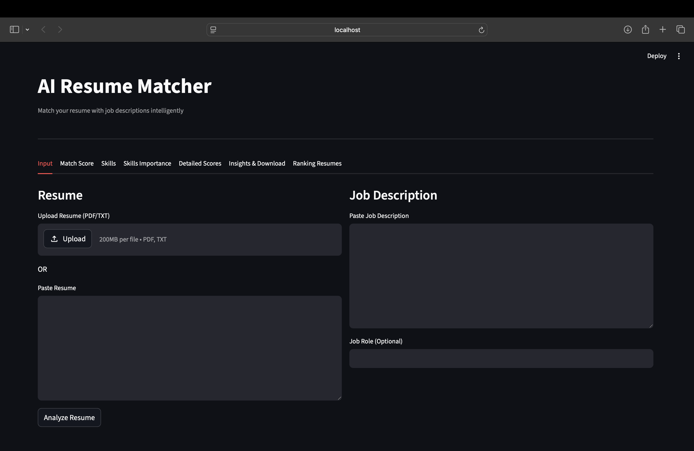
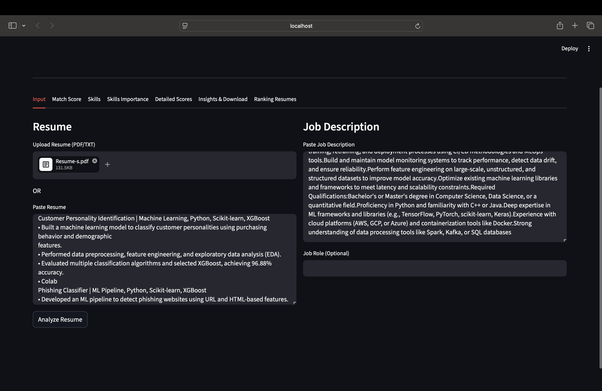
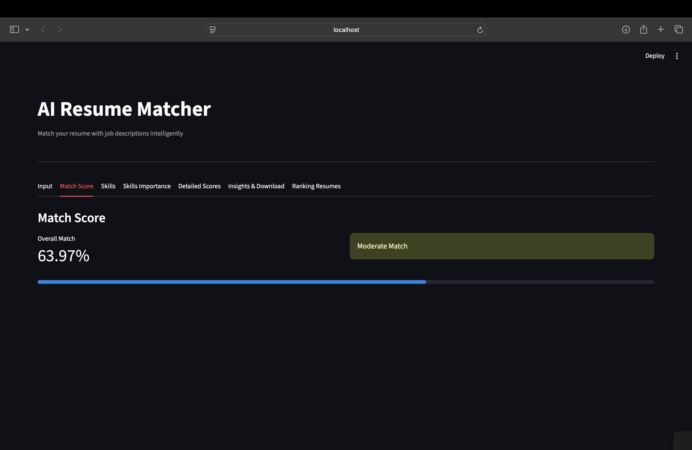
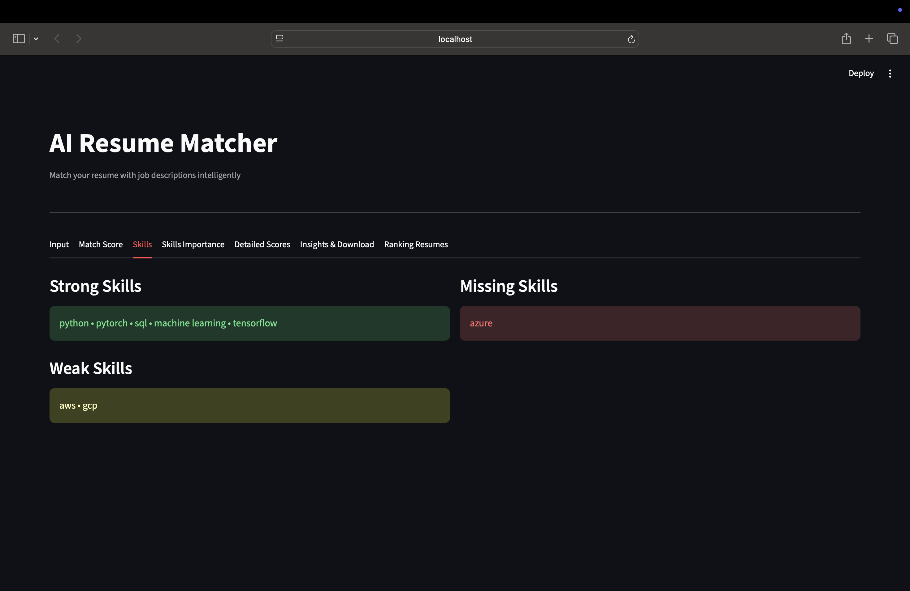
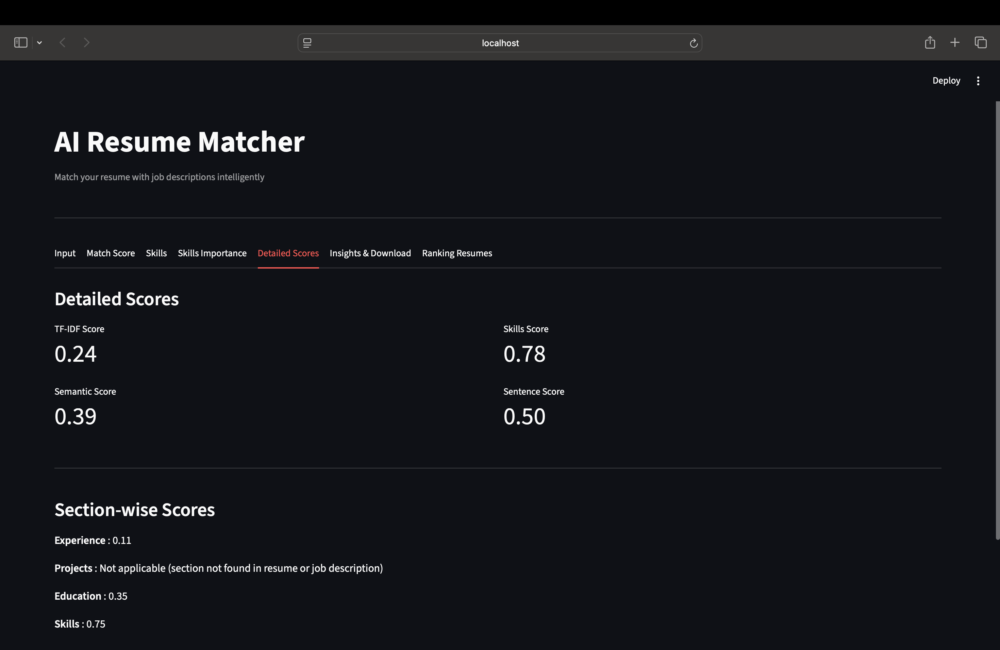
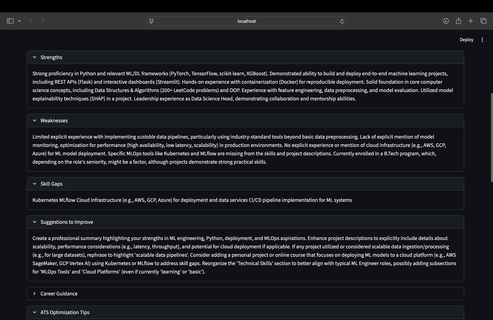
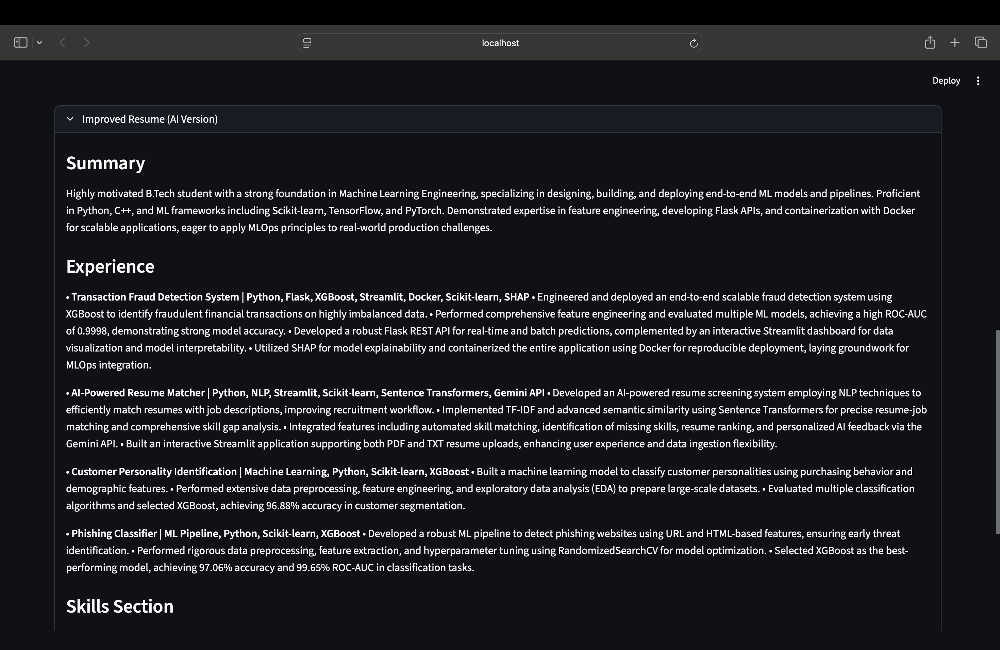
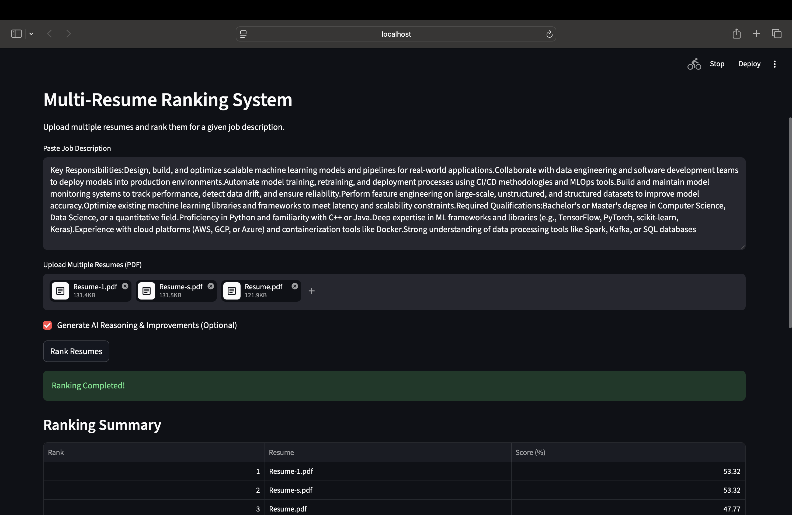
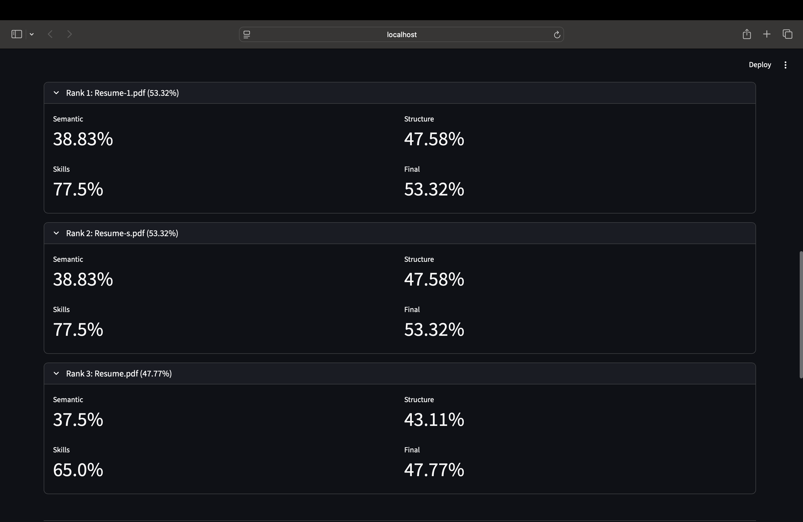
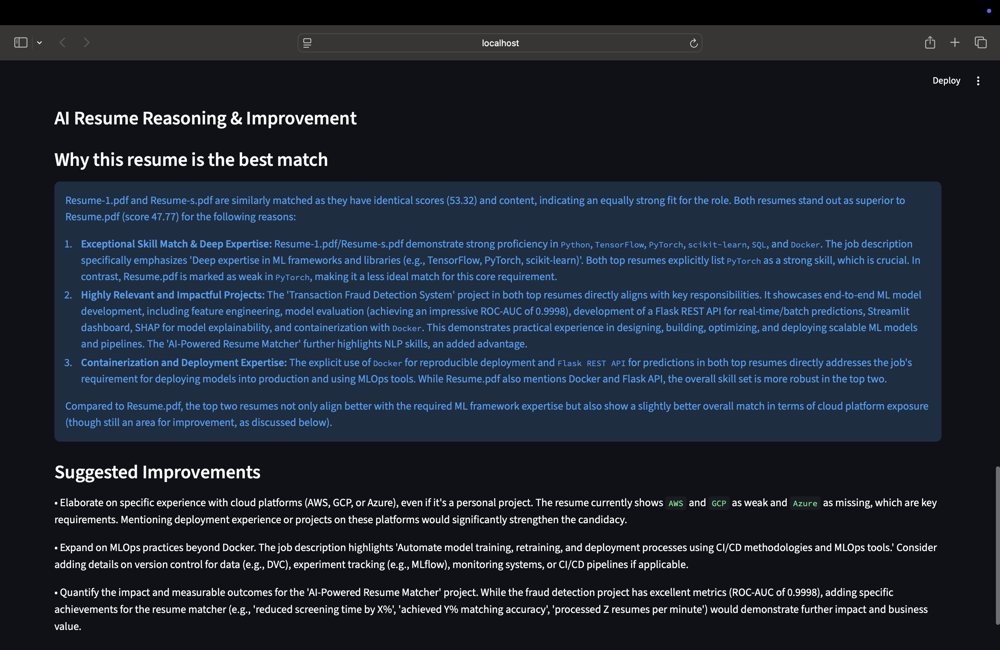

# AI Resume Matcher

AI Resume Matcher is a Streamlit-based web application that compares resumes with job descriptions and estimates how well they match.

Instead of relying only on keyword matching, the application combines traditional NLP techniques with semantic similarity and Google Gemini to provide more meaningful resume analysis, personalized feedback, and AI-assisted resume ranking.

---

# Live Demo

**Streamlit Dashboard**

https://ai-resumejobmatchscorer-bwm3pferiappw24ewfaffx7.streamlit.app

---

# Project Overview

The application allows users to upload one or more resumes and compare them against a job description.

For each resume, it generates an ATS-style match score, identifies matched and missing skills, provides AI-generated improvement suggestions, and can rank multiple resumes based on their relevance to the job description.

The goal of this project is to demonstrate how traditional Natural Language Processing techniques and Large Language Models can be combined to build a smarter resume screening system.

---

# Key Features

- Upload resumes in PDF or TXT format
- Compare resumes with a job description
- Generate an ATS-style Resume Match Score
- Extract matched and missing skills
- TF-IDF based keyword similarity
- Semantic similarity using Sentence Transformers
- AI-generated resume analysis using Google Gemini
- AI-assisted multi-resume ranking
- AI reasoning for resume rankings
- Downloadable PDF report generation
- Graceful fallback handling when AI services are unavailable

---

# How It Works

The application follows these steps while analyzing a resume:

1. Extracts text from the uploaded resume.
2. Cleans and preprocesses the resume text.
3. Extracts relevant technical skills from both the resume and job description.
4. Calculates keyword similarity using TF-IDF.
5. Calculates semantic similarity using Sentence Transformers.
6. Uses RapidFuzz for flexible skill matching.
7. Combines these scores to generate an ATS-style Resume Match Score.
8. Sends the analysis to Google Gemini to generate personalized resume feedback.
9. If multiple resumes are uploaded, ranks them using both NLP scores and AI reasoning.
10. Generates a downloadable PDF report containing the analysis.

---

# Project Structure

The project is organized into the following main components:

- **app.py** – Main Streamlit application.
- **modules/**
  - `preprocessing.py` – Resume text extraction and preprocessing.
  - `skills_extraction.py` – Skill extraction utilities.
  - `matching.py` – Resume and job description similarity calculations.
  - `scoring.py` – ATS-style scoring logic.
  - `analyzer.py` – Resume analysis workflow.
  - `multi_ranker.py` – Multi-resume ranking.
  - `model_utils.py` – Shared model loading utilities.
  - `utils.py` – Helper functions.
- **agents/**
  - Base agent implementation.
  - Career analysis agent.
  - Resume reasoning agent.
  - Prompt templates.
- **llm/**
  - Gemini integration.
  - Response generation.
  - LLM loader.
- **screenshots/** – Images used in the README.

---

# Screenshots

## Home Page

<p align="center">

</p>

---

## Resume Upload

<p align="center">

</p>

---

## Match Score

<p align="center">

</p>

---

## Skill Analysis

<p align="center">

</p>

---

## Section-wise Resume Scores

<p align="center">

</p>

---

## AI Resume Analysis

<p align="center">

</p>

---

## Improved Resume Suggestions

<p align="center">

</p>

---

## Multi-Resume Ranking

<p align="center">

</p>

### Detailed Breakdown

<p align="center">

</p>

---

## AI Ranking Reasoning

<p align="center">

</p>

---

## Error Handling

<p align="center">

</p>

---


# Tech Stack

### Programming Language

- Python

### Frontend

- Streamlit

### NLP

- TF-IDF
- Sentence Transformers (all-MiniLM-L6-v2)
- RapidFuzz
- FlashText

### AI

- Google Gemini API

### Libraries

- Pandas
- NumPy
- Scikit-learn
- ReportLab

---

# Installation

### 1. Clone the repository

```bash
git clone <repository-url>
cd AI-Resume-Matcher
```

### 2. Create a virtual environment

```bash
python -m venv venv
```

### 3. Activate the virtual environment

**Windows**

```bash
venv\Scripts\activate
```

**macOS / Linux**

```bash
source venv/bin/activate
```

### 4. Install dependencies

```bash
pip install -r requirements.txt
```

### 5. Configure the Gemini API key

**macOS / Linux**

```bash
export GEMINI_API_KEY=your_api_key
```

**Windows Command Prompt**

```cmd
set GEMINI_API_KEY=your_api_key
```

**Windows PowerShell**

```powershell
$env:GEMINI_API_KEY="your_api_key"
```

### 6. Run the application

```bash
streamlit run app.py
```

---

# Future Improvements

- Support DOCX resumes
- Improve the ATS-style scoring algorithm
- Generate interview questions based on job descriptions
- Add recruiter analytics and resume comparison insights
- Improve UI/UX
- Store previous analyses for returning users

---

# What I Learned

While building this project, I gained practical experience with:

- Text preprocessing and resume parsing
- Keyword and semantic similarity techniques
- Prompt engineering with Google Gemini
- Handling unreliable LLM responses using fallback mechanisms
- Building modular Python applications
- Developing interactive web applications with Streamlit
- Combining traditional NLP techniques with Generative AI

---

# Motivation

I built this project while learning Natural Language Processing and Large Language Models to understand how AI can be applied to real-world hiring workflows.

Working on this project helped me explore how traditional NLP methods, semantic similarity, and Generative AI can complement each other to create a more informative resume screening system instead of relying only on keyword matching.